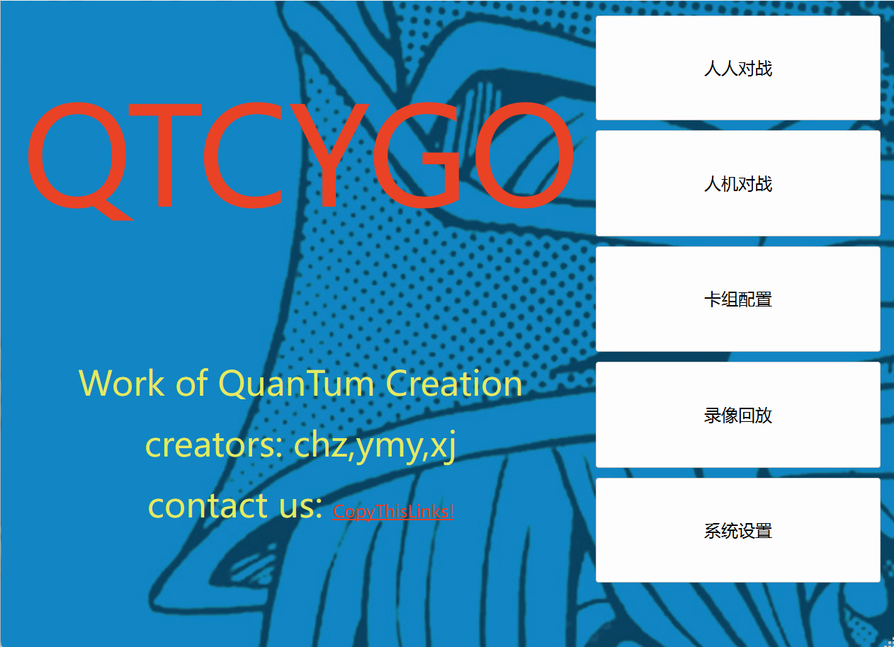
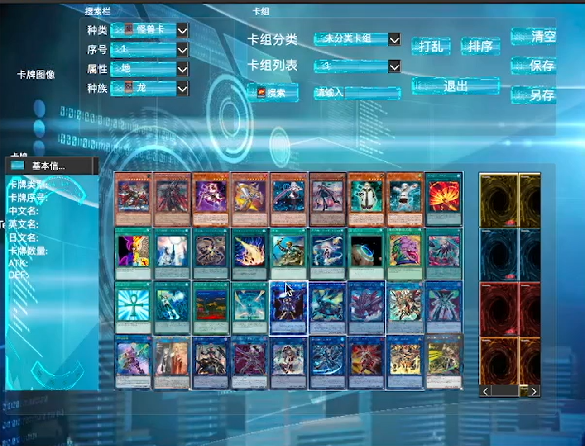
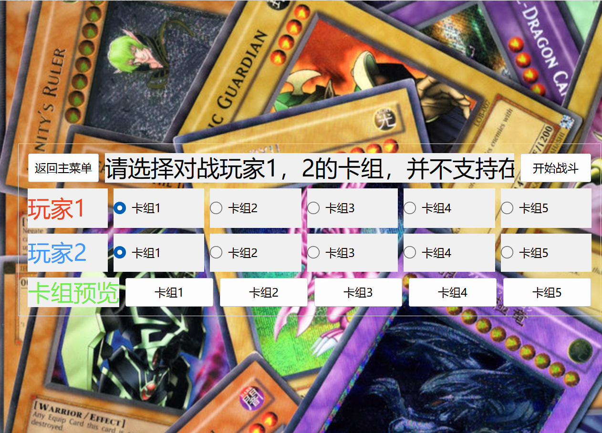
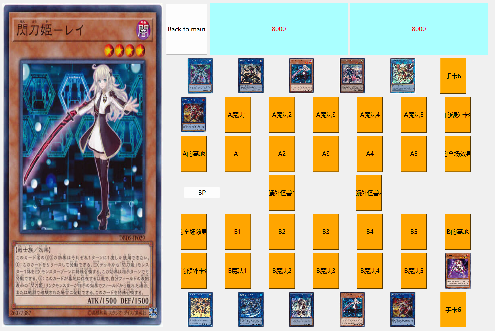
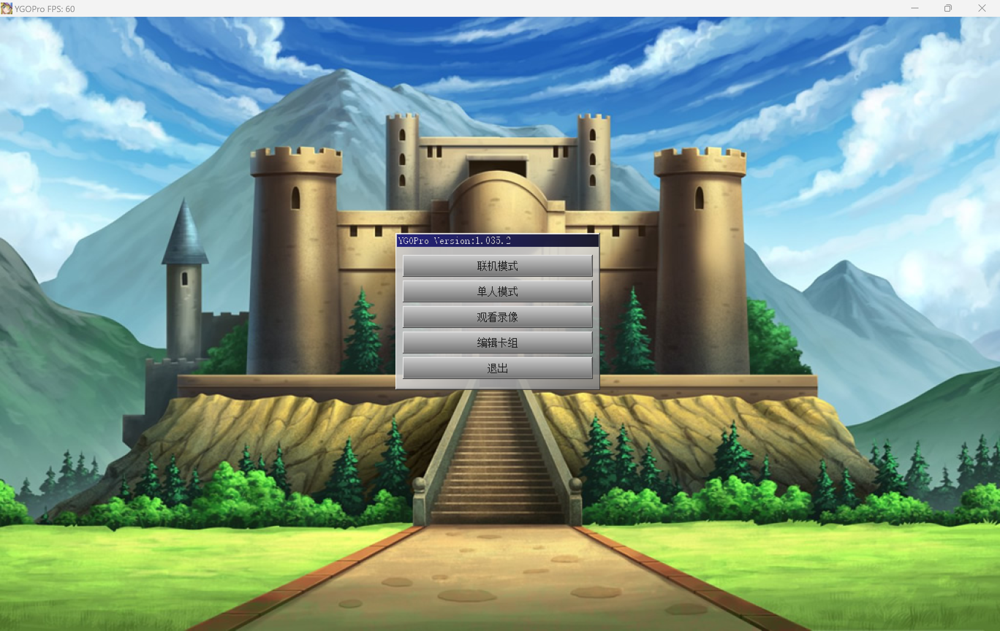
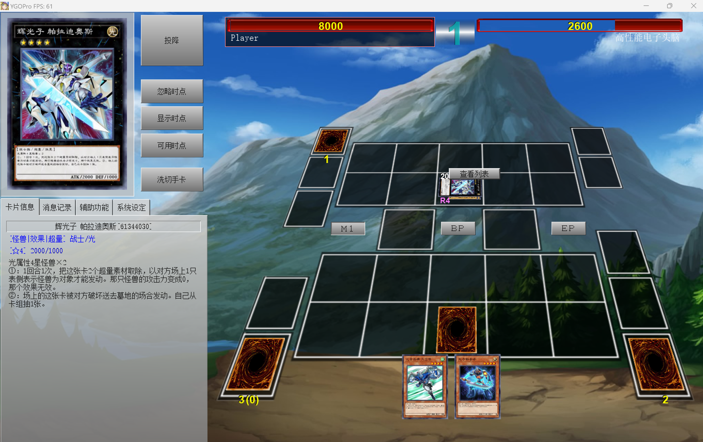

# QTCYGO游戏王作业报告

##### 作者： 曹瀚中 徐靖 于旻扬

本项目用**C++**和**qt软件**对经典卡牌游戏“游戏王”进行复刻。“游戏王”简称[YGO]([Yu-Gi-Oh! - Wikipedia](https://en.wikipedia.org/wiki/Yu-Gi-Oh!))，在诸多卡牌类游戏中无疑属于规则、卡牌种类、卡牌效果最为复杂的一类。因原版游戏中卡牌效果的复杂性和时间所限，我们最终完成了**卡组的编辑**、在不使用特殊效果卡的情况下的**双人对战**功能，更多设计仍有待完善。此报告中如有错误，敬请指正。


## 一、程序功能介绍

### （一）初始界面、卡组配置界面



- 包括“人人对战”“人机对战”“卡组配置”“录像回放”“系统设置”等按键。是对经典游戏*YGOpro*的忠实再现。
- 人机对战、录像回放部分由于时间原因未能实现。



- **点击“卡组配置”即可进入卡组配置界面。**如上图。

  

- 返回主界面。**点击“人人对战”即可进入卡组选择界面。**如下图。

### （二）卡组选择界面（对战前的准备）



- 点击相关按钮可以选择玩家1、玩家2的卡组，点击“卡组预览”中相应的卡组即可查看相关卡组。
- 最后点击“**开始战斗**”，即可进入战斗界面。

### （三）战斗界面



- 进入战斗界面，左边为卡牌信息显示区。右边为对战的棋盘。右上方为对战双方的基本分。初始双方均有5张手牌，其余的牌在牌堆里。不断点击**BP**按键即可进入下一阶段，同时这个控件也会显示当前是谁来执行、处于什么阶段。
- 玩家**点击**任何一张卡牌，在左边会显示这张卡牌的放大图片。
- 按照游戏王的规则，双方轮流操作，不断进行准备阶段、M1（主要阶段1）、BP（战斗阶段）、M2（主要阶段2）、结束阶段。**点击相应卡牌**即可在某个阶段执行相应的操作。
- 游戏的结束条件是：
  1. 有一方的牌堆为空，在准备阶段无卡可加进手牌。
  2. 有一方的基本分变为0。


##  二、小组成员分工

在前期，除了素材搜集和游戏王规则的学习和熟悉外，我们主要一人负责一个窗口的布局和背景搭建。后期，我们按照前端、后端和整合工作进行分工。前端主要负责界面设计、美术工作、界面切换、卡牌显示等相关控件制作。后端主要为对局的逻辑部分（即游戏进程控制）编写代码。

### （一）曹瀚中同学的工作

进行团队的分工，统筹任务的分派。

前期搜集了大量游戏王的卡牌信息、规则介绍，和部分图片素材，并制作了参考文档。第一阶段负责启动窗口的搭建。



第二阶段主要负责将前端和后端的代码整合，同时也参与了后端的大量工作。比如`Card`类的编写、将卡牌数据由文字导入代码、相关卡牌操作的实现。

最后，曹同学也负责了汇报视频的制作。


### （二）徐靖同学的工作

主要涉及游戏构思,前端,素材文件搜集等方面的工作。

#### 前期

1. 构思出一种基于几种元素计算效果的游戏模式，将想法形成文件。

#### 中期

1. ui布局与设计部分.设计了`cardsetting.ui,cardbank_preview.ui`,分别用于卡组设置和卡牌预览。

2. 按键逻辑部分。对`cardsetting.ui,cardbank_preview.ui`相应生成的cpp和h进行修改,利用槽函数创建其与主界面的连接。

3. 对全队的工程文件进行了第一次整合,构建出由主界面,卡组配置,卡牌预览,战斗准备,对战界面组成的基本ui框架。

4. 集群编写了`fightpre.ui`中多个用于卡组选择和预览控件的槽函数,使之能够被集中调用。

5. 编写了`mainwindow.ui`的5个槽函数,串联其他ui以及完整的游戏框架。

#### 后期

1. 从网络上搜集卡牌信息,图片,并按分类规则整理成便于调用的路径与文本格式。

2. 创建`replay.ui`、`systemsettings.ui`(及其相应的cpp和头文件),补充`mainwindow`的功能

   1. replay 用于观看对战回放,并显示对战发生的时间
   2. systemsettings 包含清空对战记录和回放等功能

3. 搜集制作游戏背景,按钮图样的素材,在素材中添加了按钮边框(使用ps制作加工)

4. 精细调整丰富了`cardsetting.ui,cardbank_preview.ui,replay.ui,systemsettings.ui`,使之成为交互体验友好的ui界面,包含以下工作:

   1. `Qpushbotton`与`Qlabel`控件样式表书写(stylesheet)
      1. 字体大小(根据不同控件灵活设置)
      2. 字体颜色(根据不同控件及其背景颜色灵活设置)
      3. 控件图案(一般使用border-image,调用已制作好的按钮样式)
   2. 卡牌图片显示功能,编写了通过参数调用特定卡牌素材路径,并将素材内容读取显示在ui界面上的函数,使相关控件实现能够独立于槽函数外调用
   3. 设置了`Qcombobox`的选项文字及其样式,字体等基本与`Qpushbotton`相同,添加了一些卡片的缩略图,作为对搜索选项的说明(如怪兽卡,不同类型的魔法卡等)
   4. 横向与纵向的`layout`,添加一批弹簧控件用于控件位置调整
   5. `QTabWidget`样式设置与调整
   6. 两个`QTableWidget`样式设置与调整(用于批量的卡片显示和搜索结果显示)
   7. 对战回放时间显示


### （三）于旻扬同学的工作

前期负责战斗界面`fightinterface.ui`的搭建，编写了相关控件，实现战斗界面、卡牌编辑界面、启动界面的切换。

后期主要负责后端逻辑部分的实现。包括`Cell`类的编写、对卡牌的初始化（赋予其坐标值、名称等信息）、模拟程序`YGO_simu.cpp`的编写、搭建对战流程框架、每一阶段的逻辑部分的具体实现。 



（这张图片为*YGPpro*的效果图）


## 三、项目各模块与类设计细节

### （一）Card类

```c++
char Kind; //   'M' 是怪兽卡，'T' 是陷阱卡 'S'是魔法卡
string imagename;
```

该类是卡牌的总类。

#### （1）MonsterCard类

- 继承Card类。包含如下属性：

- ```c++
  int ATK,DEF;//攻击力防御力
  int Stars;//星级
  int Attributes;//属性
  string Keyword;//关键字段
  string Race;//种族
  Effect a;//效果
  ```

#### （2）LinkMonster类

- 继承`MonsterCard`类，为游戏中有着特殊效果的**连接怪兽**设定，包含了`Linknumber`这一属性。

#### （3）SpellCard类

- 魔法和陷阱卡类。继承Card类。有以下属性，其中Effect是一个抽象的效果类。

-     int type; //仪式魔法/永续魔法/装备魔法/场地魔法/速攻魔法
      Effect a;

### （二）Cell类

- 含义是场上的一个个可以放置卡牌的格子。
- 有坐标、`vector <Card *> source`、卡牌的表示方式（守备表示、攻击表示、里侧表示）、当前攻击次数、属于的势力等属性。
- 程序中很多操作是围绕对某个cell的修改进行的。

### （三）Game类

- 该类在外部模拟程序`YGO_simu.cpp`中实现了，在实际的游戏中以第3个窗口**fightinterface**来代替。主要用于描述游戏的进程。
- 场上的所有Cell都是其成员变量。此外还有 `state , obj , pickTime` 等成员变量。其中state是一个整型变量，用于描述当前进行的阶段。分别用0~4表示准备阶段、M1、BP、M2、结束阶段。obj描述当前是谁的回合。点击BP按钮发送的信号对state和obj做出修改。
- pickTime用于表示本次M1阶段中，目前上场的怪兽数。根据游戏王的规定，每回合只能有1只怪兽通过**普通召唤**上场，我们用这个变量维护这种约束。
- 此外，大部分成员函数主要是控件的槽函数。结合state , obj等变量判断操作的合法性，进行游戏状态的改变。


## 四、项目总结与反思

### （一）团队合作

大家前期制作的进度较慢，没有很好地沟通与交流，大多时候是独立做的，每个人或多或少遇到了难以解决的问题。此外，很多构想浮于表面而难以实现，因此效率很低。后期我们团队集中工作、激烈讨论，将构想一步步变成现实，效率很高。

客观而言，我们目前制作的游戏与原版相较，可谓云泥之别。我们所实现的功能与当初的鸿鹄之志相去甚远。不过，这次经历告诉我们团队合作的重要性、有效沟通的重要性，也告诉我们一个看似平凡的项目具体实现也许极为困难。是以必须以认真的态度面对。

### （二）github与qt的使用

由于对Github的运用不够熟练，缺乏对版本控制工具的学习。小组直接经常通过Wechat传输代码。其次，每个人都可能同时修改同一份github上的文件，导致整合起来比较困难，

在qt的使用上，挑战是史无前例的。我们对qt的操作几乎一无所知。从点击某个button、显示一个选项列表到图片的导入、切换，这些基础的步骤我们都要花很长时间来解决。我们通过广泛学习b站资料、csdn和知乎的blog，以及询问大语言模型等方式来解决一个又一个barrier。好在这次经历使每个人都积累了不少qt使用的经验，以后的创作在工具使用方面肯定会轻松许多。


> In the end, we hope to sincerely extend our gratitude to the course *Programming Practice*, which provides us with an insight into how programmers organize their code and collaborate with each other at everyday work. Our programming capabilities have been significantly enhanced by the project.

