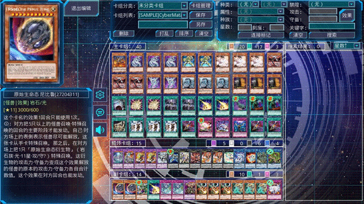

从test0分支pull到最新版本来设计

1. 不要更改原来的界面
2. 每次新建，上传到github上新的分支，不要覆盖之前的

# A

卡组预览界面ui和卡组配置界面ui

参考：

*不需要如此复杂的搜索框，适当简化即可

预览界面接在卡组选择界面下面的五个按钮上，点击跳出相应的界面，只需要做一份ui，不需要五个卡组做五个ui。卡组预览界面和选择界面需要

配置界面接口在主界面，点击进入。关闭卡组配置界面需要拉出主界面

# B

战斗界面ui，检索界面ui

参考:

*不需要如此复杂的侧边栏，但是必须要有卡片预览功能。

战斗接口在卡组选择界面之后，点击next跳转到战斗界面，关闭战斗界面需要拉出主界面

检索界面ui不需要做接口，也就是只需要做ui，但是要保证有progress bar来拖拉

